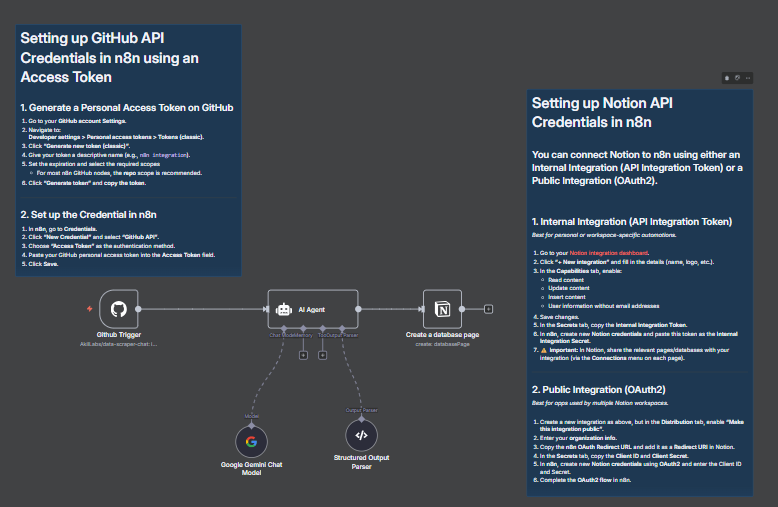

# 🔄 AI-Powered GitHub Issues to Notion Workflow# 🔄 AI-Powered GitHub Issues to Notion Work## 🚀 Setup Instructions

An intelligent n8n automation that transforms GitHub issue management by automatically syncing issues to Notion with AI-powered summarization and enrichment.### Prerequisites

- n8n instance (cloud or self-hosted)

- GitHub repository access

- Notion workspace

## 🌟 Overview- Google Gemini API access

This workflow creates a seamless bridge between **GitHub** and **Notion**, leveraging **Google Gemini AI** to automatically process, summarize, and organize GitHub issues into a structured Notion database. Perfect for teams who want to centralize their issue tracking and project management.### Step 1: GitHub API Setup

## 🔧 How It Works1. **Generate Personal Access Token**:

   - Go to GitHub → Settings → Developer settings → Personal access tokens → Tokens (classic)

The workflow consists of 4 main components:   - Click "Generate new token (classic)"

   - Name: `n8n-integration`

1. **🔗 GitHub Trigger**: Monitors your repository for new or updated issues   - Scopes: Select `repo` (full repository access)

2. **🤖 AI Agent**: Uses Google Gemini to intelligently summarize and structure issue data   - Copy the generated token

3. **📋 Structured Output Parser**: Formats the AI response into consistent JSON structure

4. **📊 Notion Database**: Creates organized pages with enriched issue information2. **Configure n8n Credentials**:

   - In n8n → Credentials → New Credential → GitHub API

### Workflow Process:   - Authentication method: Access Token

1. **Issue Detection** → GitHub webhook triggers when issues are created/updated   - Paste your token and save

2. **AI Processing** → Gemini AI analyzes the issue and creates:

   - Concise summary### Step 2: Google Gemini API Setup

   - Actionable items

   - Additional context notes1. **Get API Key**:

3. **Data Structuring** → Output is formatted with repository metadata   - Visit [Google AI Studio](https://makersuite.google.com/app/apikey)

4. **Notion Creation** → Structured data becomes a new Notion database page   - Create new API key

   - Copy the key

## 📊 Notion Database Structure

2. **Configure n8n Credentials**:

The workflow creates Notion pages with the following properties:   - In n8n → Credentials → New Credential → Google PaLM API

   - Paste your API key and save

| Column Name          | Type     | Description                    |

|---------------------|----------|--------------------------------|### Step 3: Notion API Setup

| **Title**           | Title    | Issue title from GitHub       |

| **Summary**         | Text     | AI-generated concise summary  |1. **Create Integration**:

| **Action Items**    | Text     | Key tasks and next steps      |   - Go to [Notion Integrations](https://www.notion.com/my-integrations)

| **Notes**           | Text     | Additional context            |   - Click "New integration"

| **Repository**      | Text     | Repository name               |   - Fill in details and enable capabilities:

| **Repository URL**  | URL      | Direct link to repository     |     - ✅ Read content

| **Status**          | Select   | Issue state (open/closed)     |     - ✅ Update content  

| **Last Activity**   | Date     | Last update timestamp         |     - ✅ Insert content

| **Assigned To**     | Text     | GitHub assignee information   |   - Copy the Internal Integration Token

## 🚀 Setup Instructions2. **Create Notion Database**:

   - Create a new database in Notion

### Prerequisites   - Add the columns as specified in the table above

- n8n instance (cloud or self-hosted)   - Share the database with your integration

- GitHub repository access

- Notion workspace3. **Configure n8n Credentials**:

- Google Gemini API access   - In n8n → Credentials → New Credential → Notion API

   - Paste your integration token and save

### Step 1: GitHub API Setup

### Step 4: Import and Configure Workflow

1. **Generate Personal Access Token**:

   - Go to GitHub → Settings → Developer settings → Personal access tokens → Tokens (classic)1. **Import Workflow**:

   - Click "Generate new token (classic)"   - Download `Github issue to notion database page.json`

   - Name: `n8n-integration`   - In n8n → Import from file

   - Scopes: Select `repo` (full repository access)   - Select the JSON file

   - Copy the generated token

2. **Configure Nodes**:

2. **Configure n8n Credentials**:   - **GitHub Trigger**: Select your credentials and repository

   - In n8n → Credentials → New Credential → GitHub API   - **Google Gemini Chat Model**: Select your Gemini credentials

   - Authentication method: Access Token   - **Notion Node**: Select your credentials and target database

   - Paste your token and save

3. **Activate Workflow**:

### Step 2: Google Gemini API Setup   - Test the workflow with a sample issue

   - Activate for continuous monitoringAn intelligent n8n automation that transforms GitHub issue management by automatically syncing issues to Notion with AI-powered summarization and enrichment.

1. **Get API Key**:

   - Visit [Google AI Studio](https://makersuite.google.com/app/apikey)

   - Create new API key

   - Copy the key## 🌟 Overview

2. **Configure n8n Credentials**:This workflow creates a seamless bridge between **GitHub** and **Notion**, leveraging **Google Gemini AI** to automatically process, summarize, and organize GitHub issues into a structured Notion database. Perfect for teams who want to centralize their issue tracking and project management.

   - In n8n → Credentials → New Credential → Google PaLM API

   - Paste your API key and save## 🔧 How It Works

### Step 3: Notion API SetupThe workflow consists of 4 main components:

1. **Create Integration**:1. **🔗 GitHub Trigger**: Monitors your repository for new or updated issues

   - Go to [Notion Integrations](https://www.notion.com/my-integrations)2. **🤖 AI Agent**: Uses Google Gemini to intelligently summarize and structure issue data

   - Click "New integration"3. **📋 Structured Output Parser**: Formats the AI response into consistent JSON structure

   - Fill in details and enable capabilities:4. **📊 Notion Database**: Creates organized pages with enriched issue information

     - ✅ Read content

     - ✅ Update content  ### Workflow Process:

     - ✅ Insert content1. **Issue Detection** → GitHub webhook triggers when issues are created/updated

   - Copy the Internal Integration Token2. **AI Processing** → Gemini AI analyzes the issue and creates:

   - Concise summary

2. **Create Notion Database**:   - Actionable items

   - Create a new database in Notion   - Additional context notes

   - Add the columns as specified in the table above3. **Data Structuring** → Output is formatted with repository metadata

   - Share the database with your integration4. **Notion Creation** → Structured data becomes a new Notion database page

3. **Configure n8n Credentials**:## 📊 Notion Database Structure

   - In n8n → Credentials → New Credential → Notion API

   - Paste your integration token and saveThe workflow creates Notion pages with the following properties:

### Step 4: Import and Configure Workflow| Column Name          | Type     | Description                    |

|---------------------|----------|--------------------------------|

1. **Import Workflow**:| **Title**           | Title    | Issue title from GitHub       |

   - Download `Github issue to notion database page.json`| **Summary**         | Text     | AI-generated concise summary  |

   - In n8n → Import from file| **Action Items**    | Text     | Key tasks and next steps      |

   - Select the JSON file| **Notes**           | Text     | Additional context            |

| **Repository**      | Text     | Repository name               |

2. **Configure Nodes**:| **Repository URL**  | URL      | Direct link to repository     |

   - **GitHub Trigger**: Select your credentials and repository| **Status**          | Select   | Issue state (open/closed)     |

   - **Google Gemini Chat Model**: Select your Gemini credentials| **Last Activity**   | Date     | Last update timestamp         |

   - **Notion Node**: Select your credentials and target database| **Assigned To**     | Text     | GitHub assignee information   |

3. **Activate Workflow**:## Set up steps

   - Test the workflow with a sample issue- Takes about **10–15 minutes** to set up  

   - Activate for continuous monitoring- You’ll need:

  - A **GitHub token** (for repo access)  

## 🎯 Features  - A **Notion API token** (with database shared)  

  - A **Google Gemini API key**  

- **🤖 AI-Powered Summarization**: Intelligent analysis of issue content- Configure the **GitHub Trigger**, **AI Agent**, and **Notion Database node**  

- **📊 Structured Data**: Consistent formatting for easy tracking- Activate the workflow, and you’re done 🚀  

- **🔄 Real-time Sync**: Automatic updates when issues change

- **🏷️ Rich Metadata**: Repository info, timestamps, and assignee tracking

- **📋 Action Items**: AI-extracted tasks and next steps
- **🔗 Direct Links**: Quick access to original GitHub issues

## 💡 Use Cases

- **Project Management**: Centralize issue tracking across multiple repositories
- **Team Coordination**: Keep stakeholders informed with AI summaries
- **Sprint Planning**: Organized view of issues with action items
- **Progress Tracking**: Monitor issue lifecycle and updates
- **Documentation**: Maintain structured records of development tasks

## 🛠️ Customization

You can customize the workflow by:

- **Modifying AI Prompts**: Adjust the summary style and focus areas
- **Adding Fields**: Include additional GitHub metadata
- **Filtering Issues**: Add conditions to process specific issue types
- **Notification**: Connect to Slack, email, or other services

## 📋 Troubleshooting

**Common Issues:**

1. **GitHub Webhook Not Triggering**:
   - Verify repository permissions
   - Check webhook URL in GitHub settings

2. **Notion Pages Not Created**:
   - Ensure database is shared with integration
   - Verify column names match exactly

3. **AI Responses Inconsistent**:
   - Review and refine the prompt in AI Agent node
   - Check Google Gemini API quota

## 📝 License

This project is licensed under the MIT License - see the [LICENSE](LICENSE) file for details.

---

⭐ **Star this repository** if you find it helpful! 

💬 **Questions?** Open an issue or reach out to [AkilLabs](https://github.com/AkilLabs)